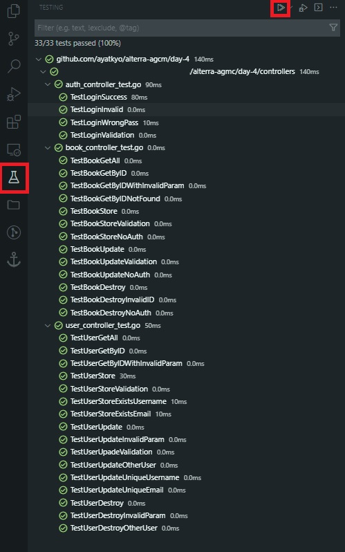

# Alterra AGMC - Day 4 Unit & Integration Testing 

## Objective

- [x] Implement Integration Testing

## Task

- Using your project from previous day, implement integration testing on controller
- Minimun test case per function is 2
  - Valid test case, e.g. http response 200, 201
  - Invalid test case, e.g. http response 400, 401, 500
- No minimum coverage percentage, but higher is better

## How to run

Run this command:

```bash
go test ./... -v
```

or when using VSCode

<p align="center">
  
</p>

- Click on **Testing** in **Activity Bar**
- Click on **Run Test**
- The test will begin