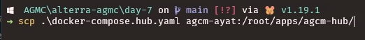
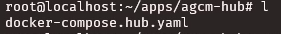
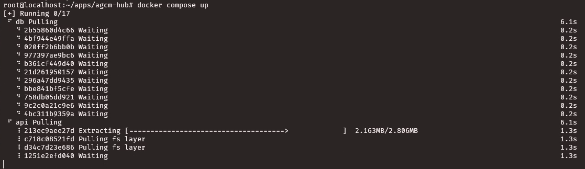
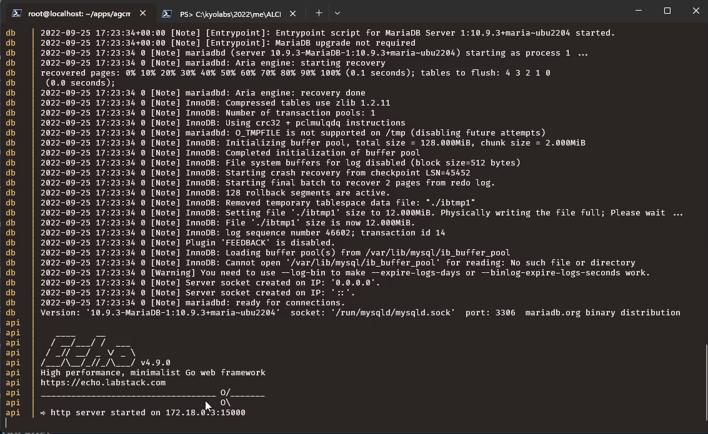
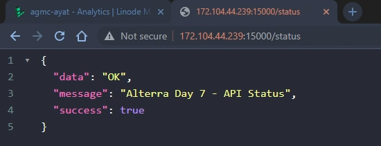

# Deploy aplikasi dengan image dari Docker Registery - Alterra AGMC (Day 8) - Deployment

> [See content in English](./en-deploy.md)

## Navigasi Utama

- [Membuat Linode Compute Instance](./id-linode-setup.md)
- [Setup SSH dengan key](./id-setup-ssh-key.md)
- [Setup Docker](./id-setup-docker.md)
- ➡️ Deploy aplikasi dengan image dari Docker Registery
- [Test akses API dari Postman](./id-postman.md)

## Daftar Isi

- [Deploy aplikasi dengan image dari Docker Registery](#deploy-aplikasi-dengan-image-dari-docker-registery)
- [Menyiapkan Direktori](#menyiapkan-direktori)
- [Menyiapkan `docker-compose.yaml`](#menyiapkan-docker-composeyaml)
- [Menjalankan Aplikasi](#menjalankan-aplikasi)

## Deploy aplikasi dengan image dari Docker Registery

Setelah instalasi docker selesai, saatnya kita melakukan deploy.

Karena pada tugas **Day 7 - Dockerize Application** kita sudah memiliki image yang disimpan di Docker Registry, maka disini kita akan menggunakan image tersebut.

Link image ada di https://hub.docker.com/r/ayatkyo/agmc-ayat

## Menyiapkan Direktori

Siapkan terlebih dahulu direktori untuk deploy aplikasi misalkan `~/apps/agmc-hub`

```bash
mkdir ~/apps/agmc-hub
```

## Menyiapkan `docker-compose.yaml`

Copy file https://github.com/ayatkyo/alterra-agmc/blob/main/day-7/docker-compose.hub.yaml ke direktori yang sudah disiapkan sebelumnya.

Karena file tersebut sudah ada pada perangkat saya, disini saya akan menggunakan `scp` untuk mengcopynya ke server.



Cek apakah sudah masuk ke server



Kemudian rename menjadi `docker-compose.yaml`

```bash
mv docker-compose.hub.yaml docker-compose.yaml
```

## Menjalankan Aplikasi

Selanjutnya jalankan aplikasi menggunakan command:

```bash
docker compose up
```



Tunggu hingga proses selesai.



Aplikasi sekarang bisa diakses menggunakan `{IP SERVER}:15000`.

Contohnya: https://agmc.ayat.dev/status

Cek route `/status` melalui browser, jika muncul output seperti berikut berarti kita sudah berhasil terdeploy.


