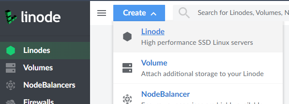
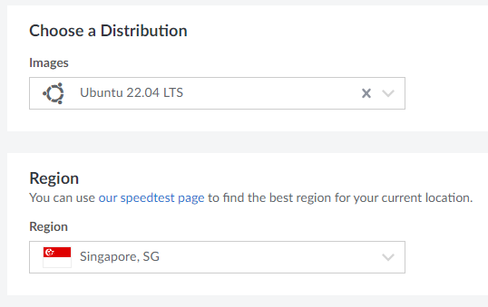
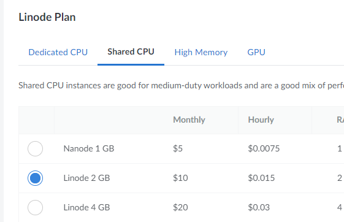
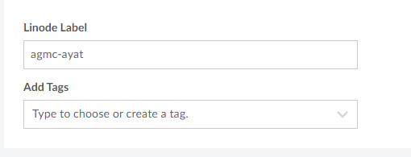
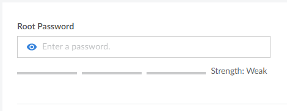
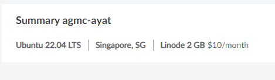
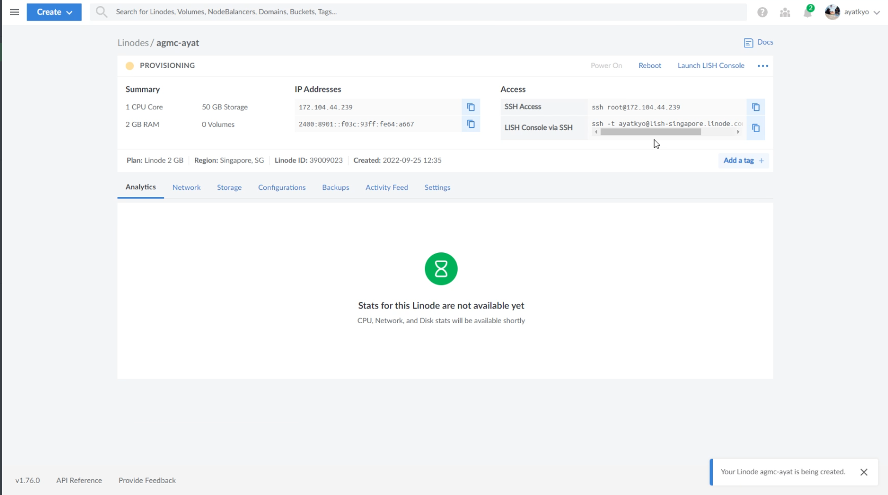
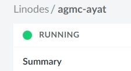

# Membuat Linode Compute Instance - Alterra AGMC (Day 8) - Deployment

> [See content in English](./en-linode-setup.md)

## Navigasi Utama

- ➡️ Membuat Linode Compute Instance
- [Setup SSH dengan key](./id-setup-ssh-key.md)
- [Setup Docker](./id-setup-docker.md)
- [Deploy aplikasi dengan image dari Docker Registery](./id-deploy.md)
- [Test akses API dari Postman](./id-postman.md)

## Membuat Linode Compute Instance

Pada Dashboard Linode, klik **Create** dan pilih **Linode** untuk membuat linode compute instance.

Pada **Distribution Images** pilih **Ubuntu 22.04 LTS** dan pada **Region** pilih region misalkan Singapore.

Pada **Linode Plan** pilih tab **Shared CPU** kemudian pilih **Linode 2 GB**.

Pada **Linode Label** masukkan nama yang diinginkan, label ini akan ditampilkan pada list linodes yang kita miliki.

Isi Root Password.

Untuk SSH Keys kita skip saja dulu, karena nanti kita akan [setup manual](./id-setup-ssh-key.md) lewat terminal saja.

Lihat summary, pastikan sudah sesuai.

Kemudian klik **Create Linode**.

Setelah itu kita akan dibawa ke halaman detail dari server yang baru saja kita buat.

Tunggu hingga status **PROVISIONING** berubah menjadi **RUNNING**.

Server sudah siap digunakan, lanjut ke [Setup SSH dengan key](./id-setup-ssh-key.md).