# Postman - Alterra AGMC (Day 8) - Deployment

> [See content in English](./en-postman.md)

## Navigasi Utama

- [Membuat Linode Compute Instance](./id-linode-setup.md)
- [Setup SSH dengan key](./id-setup-ssh-key.md)
- [Setup Docker](./id-setup-docker.md)
- [Deploy aplikasi dengan image dari Docker Registery](./id-deploy.md)
- ➡️ Test akses API dari Postman

## Daftar Isi

- [Postman](#postman)
- [Route Status](#route-status)
- [Route Auth](#route-auth)
  - [Signup](#signup-post-authsignup)
  - [Login](#login-post-authlogin)
- [Route Books](#route-books)
  - [Get all books](#get-all-books-get-apibooks)
  - [Create book](#create-book-post-apibooks)
  - [Get book by ID](#get-book-by-id-get-apibooksid)
  - [Update book](#update-book-put-apibooksid)
  - [Delete book](#delete-book-delete-apibooksid)
- [Route User](#route-user)
  - [Get all users](#get-all-users-get-apiusers)
  - [Get user by ID](#get-user-by-id-get-apiusersid)
  - [Update user](#update-user-put-apiusersid)
  - [Delete user](#delete-user-delete-apiusersid)

## Postman

Mari kita coba test akses API menggunakan Postman.

Berikut collection variable yang saya gunakan.

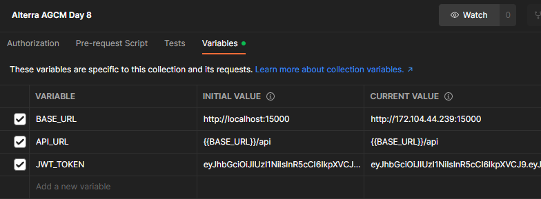

Jika ingin menggunakan collection yang sama bisa download di [sini](./Alterra%20AGMC%20Day%208.postman_collection.json).

## Route Status

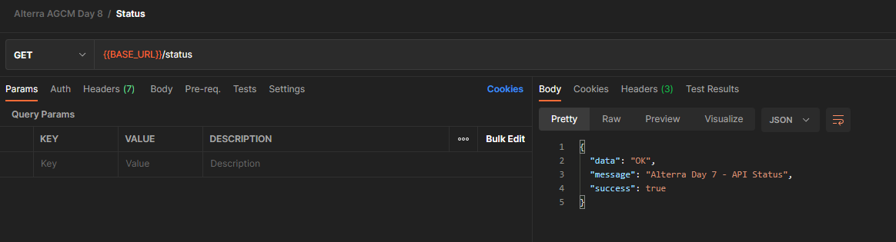

## Route Auth

### Signup (POST `/auth/signup`)

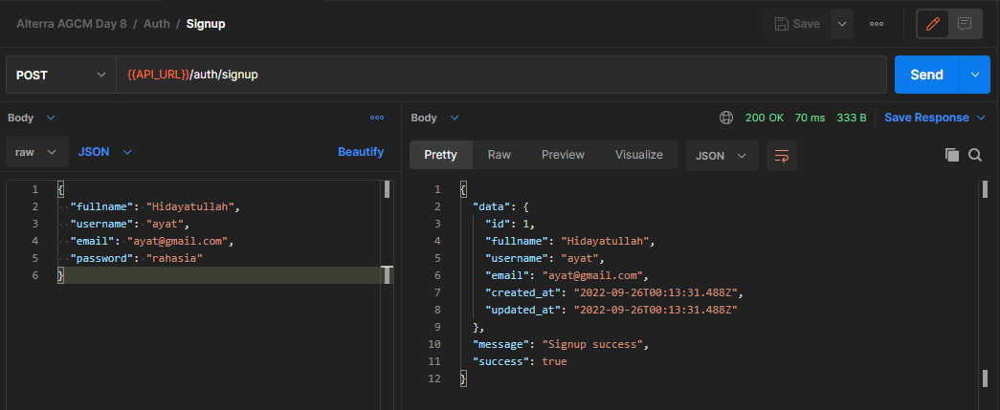

### Login (POST `/auth/login`)

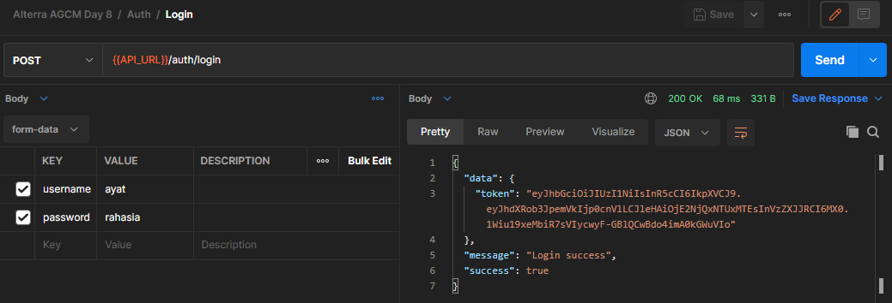

## Route Books

### Get all books (GET `/api/books`)

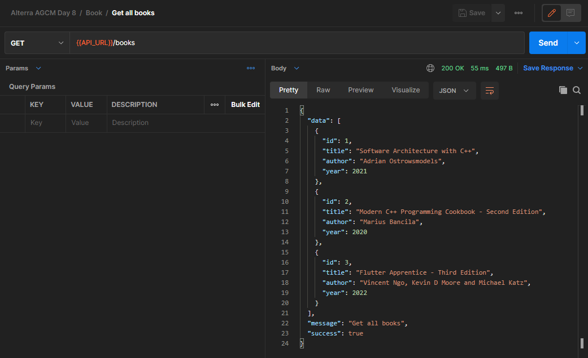

### Create book (POST `/api/books`)

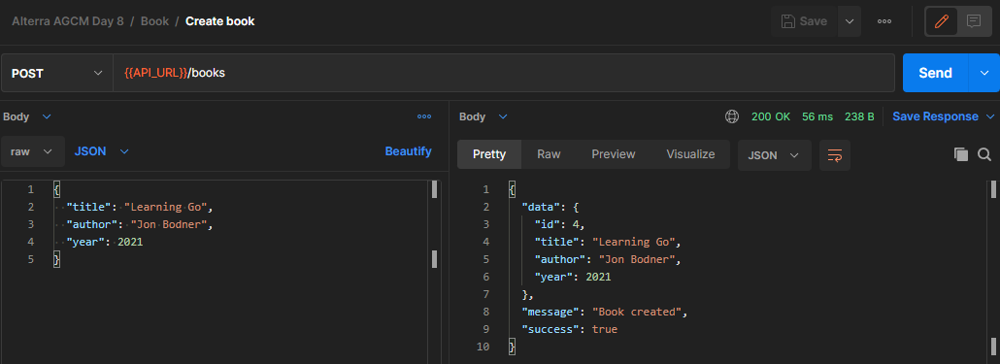

### Get book by ID (GET `/api/books/:id`)

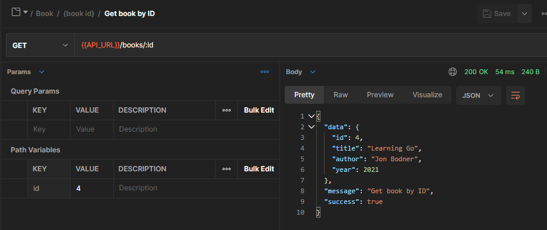

### Update book (PUT `/api/books/:id`)

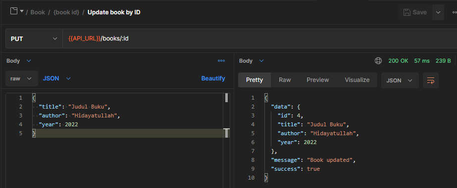

### Delete book (DELETE `/api/books/:id`)

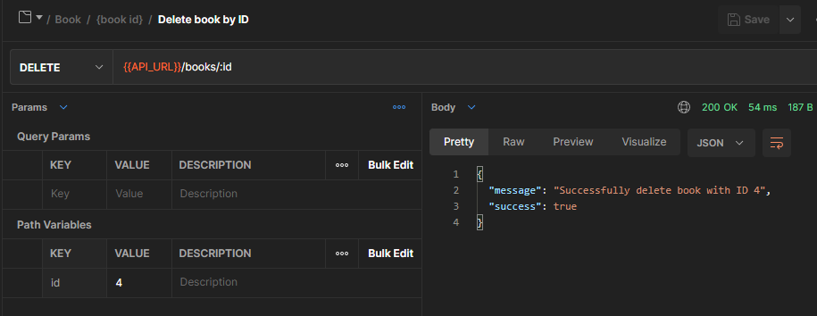

## Route User

### Get all users (GET `/api/users`)

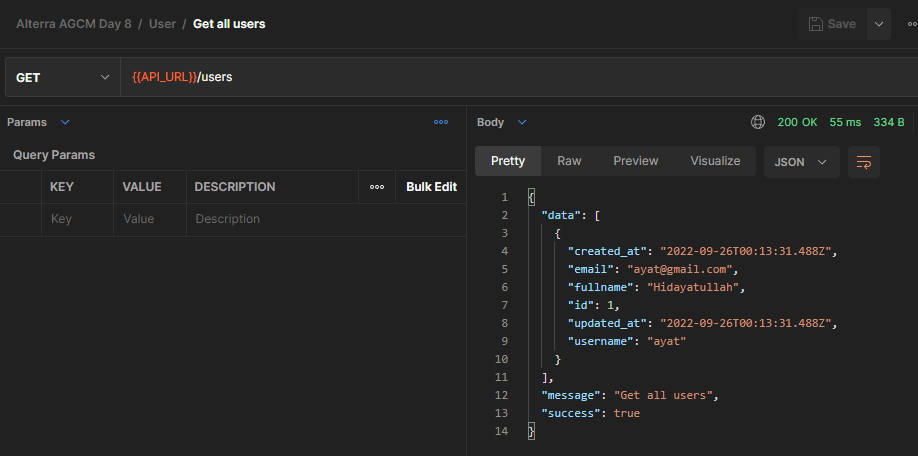

### Get user by ID (GET `/api/users/:id`)

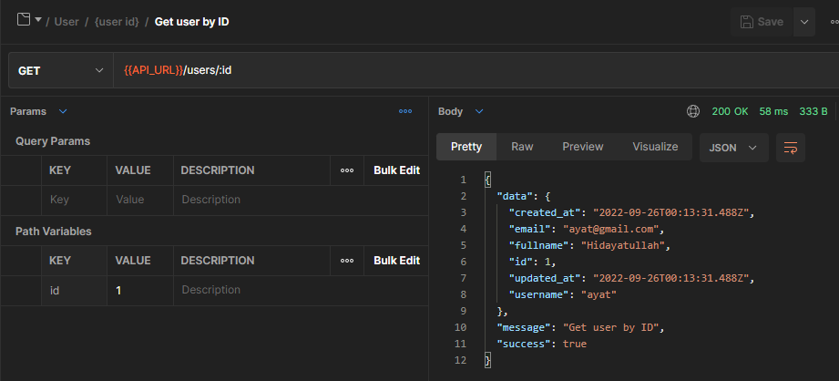

### Update user (PUT `/api/users/:id`)

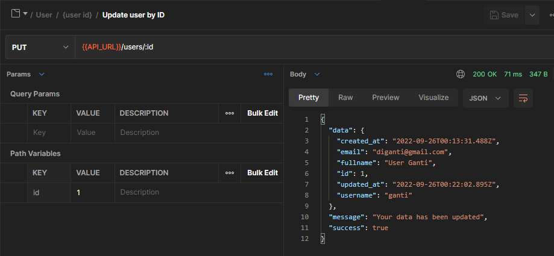

### Delete user (DELETE `/api/users/:id`)

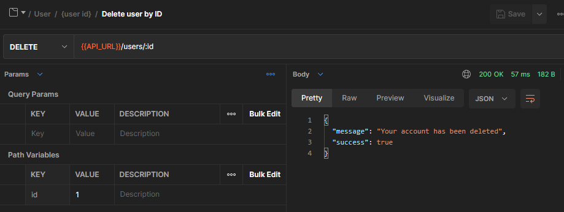
