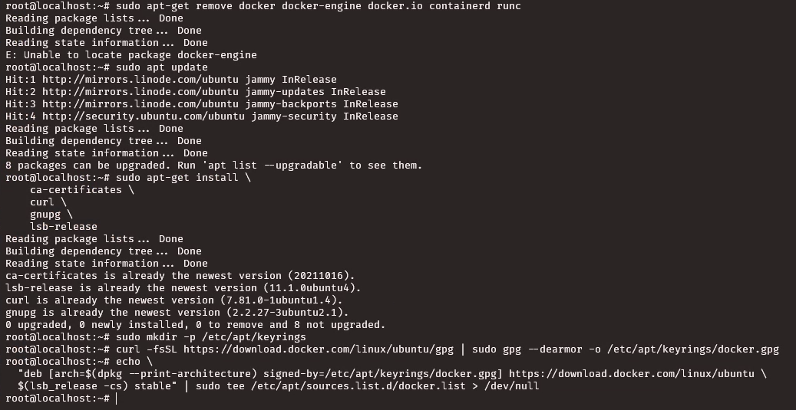
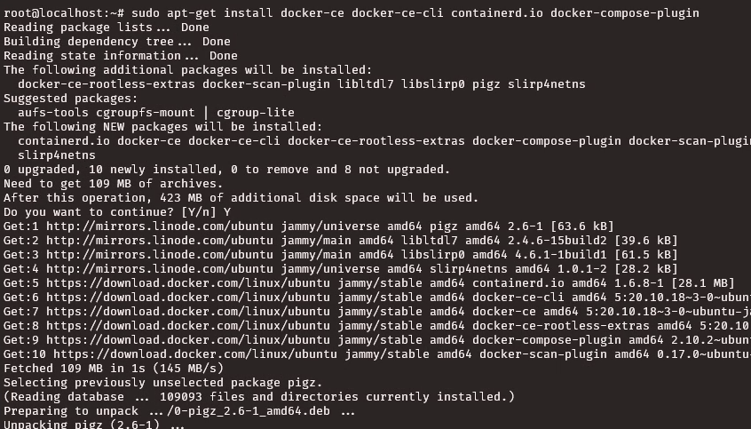
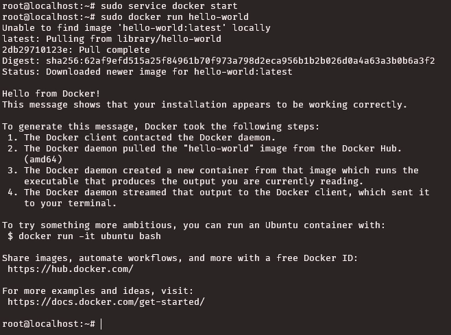

# Setup Docker - Alterra AGMC (Day 8) - Deployment

> [See content in English](./en-setup-docker.md)

## Navigasi Utama

- [Membuat Linode Compute Instance](./id-linode-setup.md)
- [Setup SSH dengan key](./id-setup-ssh-key.md)
- ➡️ Setup Docker
- [Deploy aplikasi dengan image dari Docker Registery](./id-deploy.md)
- [Test akses API dari Postman](./id-postman.md)

## Daftar Isi

- [Setup Docker](#setup-docker)
- [Menambah Repository Docker](#menambah-repository-docker)
- [Install Docker](#install-docker)
- [Test Instalasi Docker](#test-instalasi-docker)

## Setup Docker

Lakukan **update** serta **upgrade** terlebih dahulu menggunakan command:

```bash
sudo apt update
sudo apt upgrade
```

## Menambah Repository Docker

Kemudian tambahkan repository docker dengan command:

```bash
sudo get install \
    ca-certificates \
    curl \
    gnupg \
    lsb-release
sudo mkdir -p /etc/apt/keyrings
curl -fsSL https://download.docker.com/linux/ubuntu/gpg | sudo gpg --dearmor -o /etc/apt/keyrings/docker.gpg
echo \
  "deb [arch=$(dpkg --print-architecture) signed-by=/etc/apt/keyrings/docker.gpg] https://download.docker.com/linux/ubuntu \
  $(lsb_release -cs) stable" | sudo tee /etc/apt/sources.list.d/docker.list > /dev/null
```



## Install Docker

Selanjutnya install docker menggunakan command:

```bash
sudo apt update
sudo apt install docker-ce docker-ce-cli containerd.io docker-compose-plugin
```




## Test Instalasi Docker

Jika sudah selesai jalankan service docker dan test dengan menjalankan image hello-world.

```bash
sudo service docker start
sudo docker run hello-world
```

Jika tidak ada error, maka docker sudah berhasil terinstall pada server.

