# Setup SSH dengan key - Alterra AGMC (Day 8) - Deployment

> [See content in English](./en-setup-ssh-key.md)

## Navigasi Utama

- [Membuat Linode Compute Instance](./id-linode-setup.md)
- ➡️ Setup SSH dengan key
- [Setup Docker](./id-setup-docker.md)
- [Deploy aplikasi dengan image dari Docker Registery](./id-deploy.md)
- [Test akses API dari Postman](./id-postman.md)

## Daftar Isi

- [Setup SSH dengan key](#setup-ssh-dengan-key)
- [Generate key](#generate-key)
- [Upload public key ke server](#upload-public-key-ke-server)
- [Membuat `~/.ssh/config`](#membuat-sshconfig)

## Setup SSH dengan key

Karena pada saat pembuatan server kita melewati konfigurasi ssh key, maka sekarang kita akan setup ssh key secara manual.

Pertama masuk ke server dengan menggunakan **Launch LISH Console**.

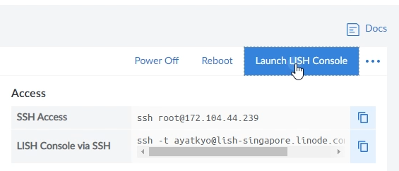

Akan muncul sebuah jendela terminal seperti berikut.

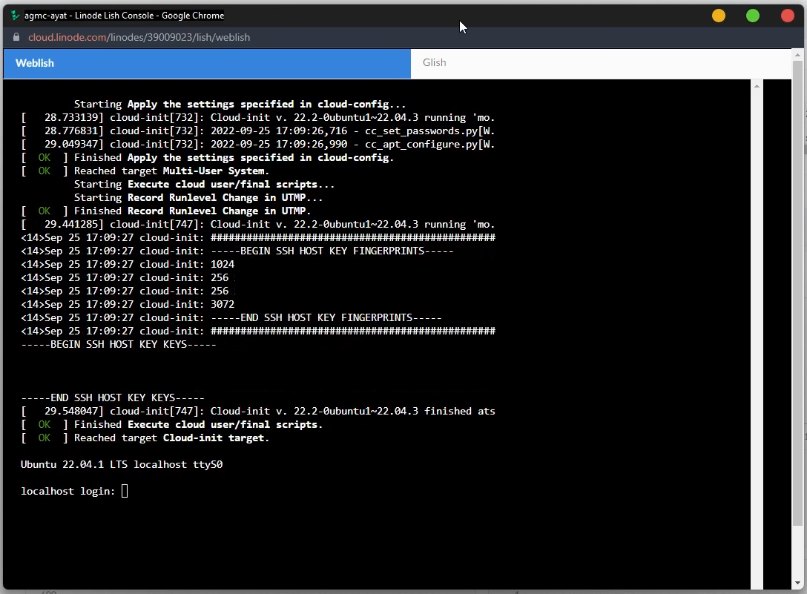

Masukkan username dan password yang sudah dibuat sebelumnya.

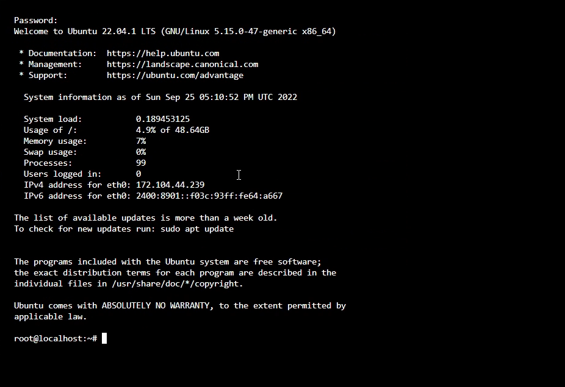

Cek apakah sudah ada `~/.ssh/authorized_keys` pada server, jika belum maka buat lah terlebih dahulu dan pastikan permissionnya sudah sesuai.

- 700 untuk `~/.ssh`
- 600 untuk `~/.ssh/authorized_keys`

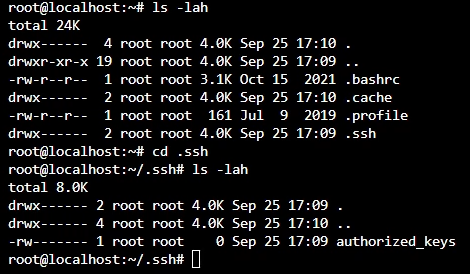

Selanjutnya kita akan memasukkan `public key` dari perangkat yang akan mengakses server lewat ssh.

## Generate key

Pada perangkat yang digunakan untuk mengakses server, buka `~/.ssh`  kemudian jalankan command:

```bash
ssh-keygen -b 4096
```

Jika tidak ingin menggunakan nama default `id_rsa` masukkan nama lain misalkan `agmc-ayat`

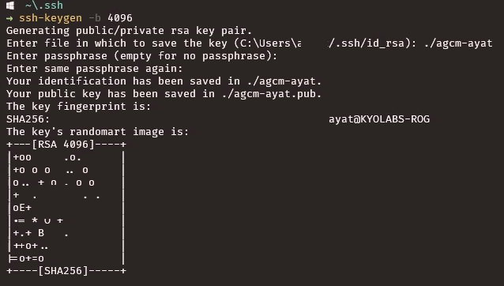

Jika sudah selesai maka akan muncul 2 file baru sesuai nama yang sudah dimasukkan sebelumnya.

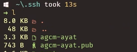

Jalankan command berikut untuk menampilkan isi dari **public key**.

```bash
cat {NAMA_FILE}.pub
```

Kemudian copy outputnya. Ini akan kita gunakan nanti saat melakukan konfigurasi di server.

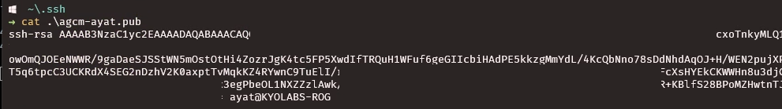

## Upload public key ke server

Pada terimal server, edit file `~/.ssh/authorized_keys`

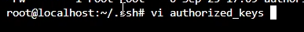

Paste isi dari **public key** yang telah kita copy sebelumnya kemudian simpan.

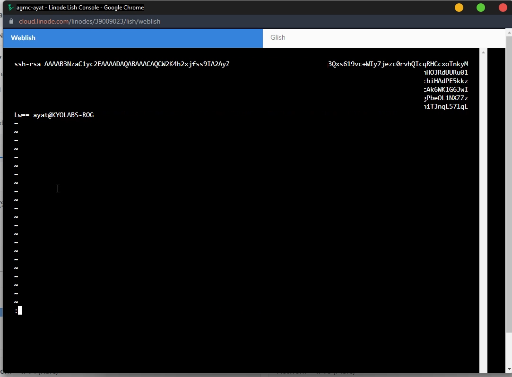

Gunakan command `cat` untuk memastikan **public key** sudah tersimpan pada file `authorized_keys`

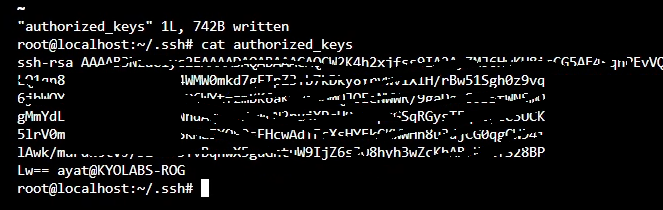

## Membuat `~/.ssh/config`

Agar memudahkan kita mengakses server tanpa harus mengetik ip dan option-option lainnya, kita bisa menggunakan `~/.ssh/config`

Buka file tersebut dan tambahkan konfigurasi sesuai dengan server tujuan.

```ini
Host {NAMA ALIAS}
  HostName {IP SERVER}
  User {USERNAME}
  IdentityFile {PATH PRIVATE KEY}
```

Contoh sebagai berikut:

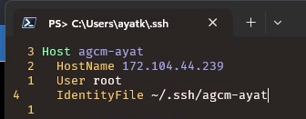

Simpan dan coba akses ke server menggunakan {NAMA ALIAS} yang sudah kita buat.

```bash
ssh agmc-ayat
```

Maka kita akan berhasil masuk ke server cukup menggunakan aliasnya saja.

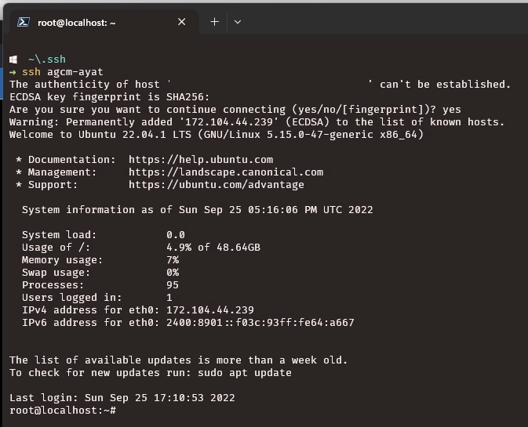
